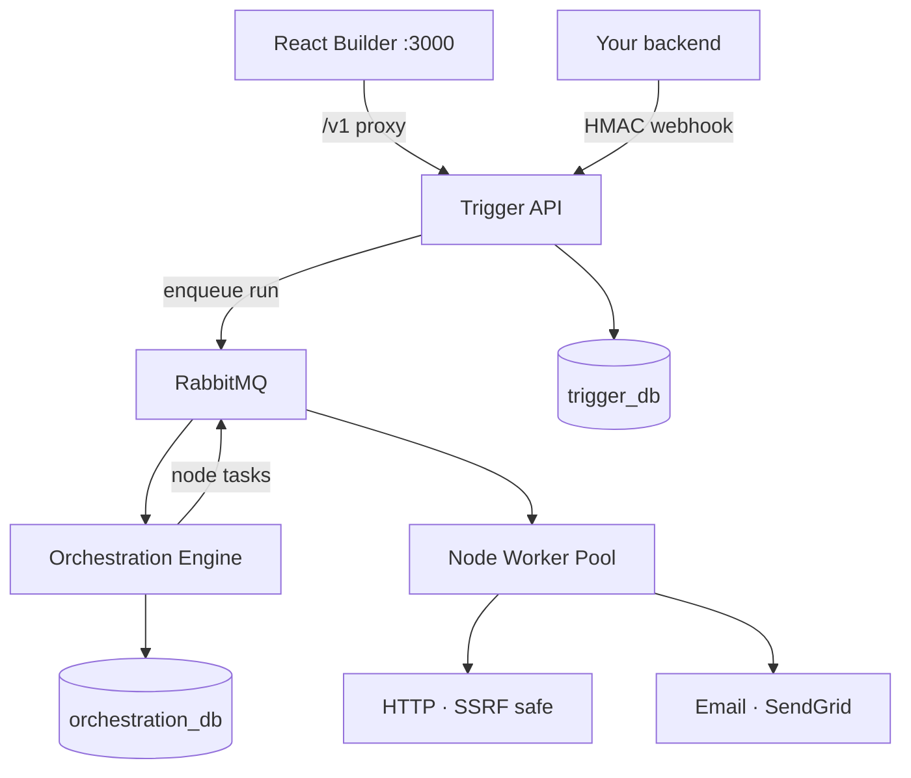

# Loom

[](https://golang.org/)
[](https://www.docker.com/)
[](LICENSE)

**Loom** is a self-hosted workflow automation engine with a **visual builder**, **gallery templates**, and a **hardened execution runtime**. Define workflows as DAGs (HTTP, email, transforms), trigger them manually, on a **cron schedule**, or via **HMAC-signed webhooks** — then inspect **per-step JSON output** in the UI.

> **Try it in 2 minutes:** `docker compose up -d` → open **http://localhost:3000** → Gallery → **Call an API** → Save → Run → Results.

---

## What you can demo

| Flow | What it shows |
|------|----------------|
| **Call an API** (gallery) | Manual trigger → HTTP GET → Transform; full JSON in Results |
| **API Health Check** + cron | Schedule `*/1 * * * *` → ping your `/health` URL; auto-runs, no Run button |
| **Webhook to HTTP** | Signed webhook in → forward POST to a public URL |
| **SDK + webhook** | Backend triggers email/HTTP workflows with idempotency |

---

## Quick start (Docker)

### Prerequisites

- Docker & Docker Compose
- Optional: SendGrid API key for the **Email** node

### 1. Clone and configure

```bash
git clone https://github.com/itsokAsh/Loom.git
cd Loom
cp .env.example .env
```

Edit `.env` if you need SendGrid or custom admin keys (default dev admin key: `dev-admin-key`).

### 2. Start the stack

```bash
docker compose up -d --build
```

| Service | URL |
|---------|-----|
| **Workflow builder (UI)** | http://localhost:3000 |
| **Trigger API** | http://localhost:8080 |
| **Health** | http://localhost:8080/healthz |

The UI proxies `/v1` to the API. Use header `X-Admin-API-Key: dev-admin-key` for management routes.

### 3. Build a workflow in the UI

1. Open **Gallery** → e.g. **Call an API** or **API Health Check**
2. **Configure** nodes (HTTP URL, cron on Schedule, etc.)
3. **Save** (top bar)
4. For **Schedule**: Schedule node → set cron → **Start schedule** → open **Results** (runs appear automatically)
5. For **Manual**: **Run** tab or top-bar Run → **Results** shows trigger input + each step’s JSON

More detail: [`docs/UI_INIT.md`](docs/UI_INIT.md) · Deploy notes: [`docs/UI_DEPLOY.md`](docs/UI_DEPLOY.md)

### Local UI dev (optional)

```bash
cd ui
npm install
npm run dev
```

Runs Vite on http://localhost:5173 with API proxy to `:8080`.

---

## Workflow builder

- **Palette**: Manual, Webhook, Schedule, HTTP, Email, Transform
- **Tabs**: Configure → Run (or Test) → **Results** (per-step status + output JSON)
- **Templates**: beginner-ready gallery (no secrets required for **Call an API**)
- **Cron**: start/stop schedule, live **next run** time, auto-refresh Results on scheduled runs
- **Readiness checklist**: save workflow, start cron, see a run in Results

---

## Core platform features

- **Hardened HTTP node**: SSRF / private IP / metadata endpoint blocklist; no localhost callbacks
- **Idempotency**: webhook and execution deduplication via DB constraints
- **HMAC webhooks**: `X-Signature` + `Idempotency-Key` on inbound triggers
- **Cron scheduler**: Postgres-backed schedules with poller (e.g. health checks every minute)
- **DAG orchestration**: RabbitMQ between API, engine, and worker pool
- **Execution history**: per-node status, errors, and `output` JSON (UI + API)
- **Templates**: gallery create with config interpolation; featured **Call an API**, health check, webhook relay
- **Credentials**: encrypted SendGrid keys for Email node (optional)
- **Email node**: SendGrid integration (BYOK)

---

## Architecture



Three services, separate scaling axes:

| Service | Role |
|---------|------|
| **trigger-api** | Workflows, webhooks, schedules, templates, credentials, executions API |
| **orchestration-engine** | DAG evaluation, trigger interpolation, dispatch |
| **node-worker-pool** | HTTP, email, transform execution |

---

## Design decisions (interview notes)

- **Queues between services** so slow HTTP never blocks the API or scheduler
- **Trigger data in orchestration DB** — Results show real `cron_time` vs manual test JSON
- **Schedule in Postgres**, not only on canvas — cron survives UI reloads; one active cron per workflow
- **Start nodes (Manual/Webhook/Schedule) in `dag.ui`** — worker DAG stays minimal for the engine
- **Idempotency keys** — `manual-*` for UI runs, `cron-{schedule}-{timestamp}` for scheduled runs

---

## API example (without UI)

Create a workflow:

```bash
curl -X POST http://localhost:8080/v1/workflows \
  -H "Content-Type: application/json" \
  -H "X-Admin-API-Key: dev-admin-key" \
  -d '{
    "name": "Ping health",
    "dag": {
      "nodes": [{
        "id": "ping",
        "type": "HTTP",
        "config": {
          "method": "GET",
          "url": "https://jsonplaceholder.typicode.com/todos/1"
        }
      }],
      "edges": []
    }
  }'
```

Execute manually:

```bash
curl -X POST http://localhost:8080/v1/workflows/<WORKFLOW_ID>/execute \
  -H "Content-Type: application/json" \
  -H "X-Admin-API-Key: dev-admin-key" \
  -d '{"triggerData": {"note": "optional"}}'
```

List execution node outputs:

```bash
curl http://localhost:8080/v1/executions/<EXECUTION_ID>/nodes \
  -H "X-Admin-API-Key: dev-admin-key"
```

---

## SDK (webhook triggers from your app)

Install:

```bash
go get github.com/itsokAsh/Loom/sdk/go
# or
pip install git+https://github.com/itsokAsh/Loom.git#subdirectory=sdk/python
```

Create a workflow and webhook via API (see above), then trigger from your backend with the SDK — fire-and-forget so your API never waits on SendGrid or HTTP latency. Full walkthrough remains in the SDK sections of this repo’s history; see `sdk/` for clients.

---

## Security

- SSRF defense on outbound HTTP (IP blocklist, no internal/metadata hosts)
- Webhook HMAC verification and timestamp window
- Admin API key on management routes
- Credentials stored encrypted (Email node); not embedded in workflow JSON

---

## Docs

| Doc | Purpose |
|-----|---------|
| [`docs/UI_INIT.md`](docs/UI_INIT.md) | Builder walkthrough |
| [`docs/UI_DEPLOY.md`](docs/UI_DEPLOY.md) | UI Docker / nginx |
| [`docs/Overview.md`](docs/Overview.md) | Original backend-focused scope |
| [`docs/TROUBLESHOOTING.md`](docs/TROUBLESHOOTING.md) | Common issues |
| [`docs/QUICKSTART_EMAIL_NODE.md`](docs/QUICKSTART_EMAIL_NODE.md) | SendGrid email node |

---

## Contributing

Contributions welcome — new node types, tests, and orchestration improvements. See existing patterns in `node-worker-pool/internal/nodes/`.

## License

MIT — see [`LICENSE`](LICENSE).
