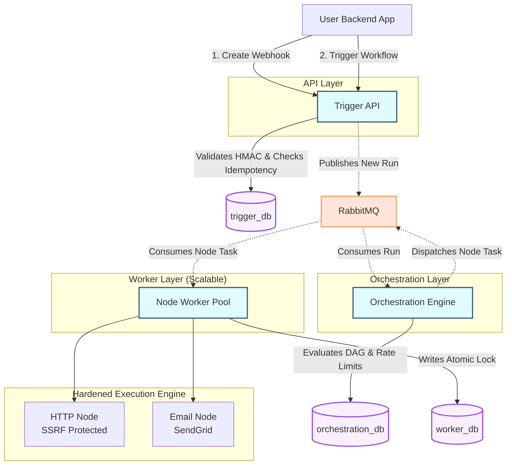

# Loom

[](https://golang.org/)
[](https://www.docker.com/)
[](LICENSE)

Loom is a **production-ready, security-first workflow automation engine** designed for enterprise systems. Built specifically for developers who need to reliably execute arbitrary side-effects (like triggering emails or HTTP webhooks) without exposing their internal networks to SSRF attacks, race conditions, or duplicate executions.

Unlike general-purpose UI-based tools like Zapier or n8n, Loom is an API-first microservice infrastructure designed to sit quietly behind your backend application. You bring the logic; Loom handles the reliability, retries, and rate limits.

---

## ⚡ Why Loom?

When your backend needs to trigger a critical workflow (e.g., sending an onboarding email to a new user), you face several challenges:
1. **Network Failures**: If SendGrid is down, your API hangs.
2. **Duplicate Triggers**: If a user double-clicks "Register", they get two emails.
3. **Security Vulnerabilities**: If a workflow executes an HTTP webhook provided by a user, you risk SSRF and DNS Rebinding attacks against your internal AWS metadata servers.

**Loom solves this by providing a hardened, asynchronous execution environment.**

## ✨ Core Features

- **Hardened Execution Engine**: Native SSRF and DNS Rebinding protection. Loom automatically blocks requests to localhost, private subnets (10.x, 192.168.x), and cloud metadata endpoints (169.254.x).
- **Strict Idempotency**: Built-in transactional Outbox patterns and database-level `INSERT ON CONFLICT` locks ensure no workflow or side-effect (like an email) is ever executed twice, even during severe network partitioning or worker crashes.
- **Dead Letter Queues (DLQ)**: Configurable retry policies with exponential backoff. Tasks that persistently fail (e.g., after 3 attempts) are gracefully routed to a Dead Letter Queue instead of burning your API quotas.
- **HMAC Authenticated Webhooks**: Webhooks are securely signed with HMAC-SHA256. Loom rejects malicious payloads instantly, ensuring only your verified backend can trigger workflows.
- **Template System**: Dynamically interpolate data passed from your triggers directly into your nodes using Go's text/template engine (e.g., `{{trigger.data.email}}`).
- **Bring Your Own API Key (BYOK)**: Loom is fully self-hosted infrastructure. You retain complete control over your external providers (e.g., SendGrid).

---

## 🏗️ Architecture

Loom is built on a shared-nothing microservices architecture designed to scale horizontally:



---

## 🚀 Getting Started

### 1. Prerequisites

Loom requires Docker and Docker Compose. You will also need your own API keys for the nodes you intend to use.

### 2. Configure Environment

Clone the repository and set up your environment variables:

```bash
git clone https://github.com/your-org/loom.git
cd loom

# Copy the example environment file
cp .env.example .env
```

Open `.env` and add your provider keys. For example, to use the Email node:
```env
SENDGRID_API_KEY=SG.your_actual_key_here
```

### 3. Start the Infrastructure

Boot up the entire stack (Databases, Queues, APIs, and Workers) with a single command:

```bash
docker-compose up -d
```
*Loom will automatically run all database migrations and boot the microservices. They are protected by active health and readiness probes.*

---

## 💻 Developer SDK Usage

Once Loom is running on your servers, your backend applications communicate with it using our official SDKs. 

### 1. Create a Workflow Definition

First, you need to tell Loom what exactly you want to happen when a workflow is triggered. You do this by defining a DAG (Directed Acyclic Graph) of nodes. 

Let's create a workflow that sends a "Welcome" email. Run this in your terminal:

```bash
curl -X POST http://localhost:8080/v1/workflows \
  -H "Content-Type: application/json" \
  -d '{
    "name": "User Onboarding",
    "dag": {
      "nodes": [{
        "id": "welcome_email",
        "type": "EMAIL",
        "config": {
          "to": "{{trigger.data.email}}",
          "subject": "Welcome to our app!",
          "body": "Hi {{trigger.data.name}}, glad to have you."
        }
      }],
      "edges": []
    }
  }'
```

**What happens next?** 
Loom saves this workflow and replies with an ID. It will look like this:
```json
{
  "id": "123e4567-e89b-12d3-a456-426614174000",
  "name": "User Onboarding"
}
```
*Copy that `id` string—you will need it for the next step!*

---

### 2. Generate Secure Webhook Credentials

Now that Loom knows *what* to do, it needs a secure way for your application to trigger it. We create a **Webhook** attached to your new workflow ID.

Run this command, replacing `YOUR_WORKFLOW_ID` with the ID you copied above:

```bash
curl -X POST http://localhost:8080/v1/workflows/YOUR_WORKFLOW_ID/webhooks
```

**The Response:**
Loom will instantly generate a highly secure, random `path` and `secret` for you:
```json
{
  "path": "x8f9b2a1q3z",
  "secret": "u8J3kP9mN2qR4sT5vW6xY7zA8bC9dE0f"
}
```
- **path**: The endpoint URL your SDK will use to trigger the workflow.
- **secret**: A cryptographic key your SDK will use to sign requests. **Keep this safe!** Without it, nobody can trigger your workflow.

---

### 3. Integrating the SDK into Your Project

Now it's time to trigger this workflow from your *own* backend application (e.g., your Login API). 

**Install the SDK:**
In your backend project, install the Loom SDK via your package manager:

*For Go:*
```bash
go get github.com/EgyptianMama/Loom/sdk/go
```
*For Python:*
```bash
pip install git+https://github.com/EgyptianMama/Loom.git#subdirectory=sdk/python
```

**Write the Code:**
Here is a real-world example of how to integrate the Loom SDK directly into your own backend API (like a user registration endpoint). 

Create a file (e.g., `main.go`) and add the following code:

```go
package main

import (
	"encoding/json"
	"log"
	"net/http"

	"github.com/loom/sdk-go/loom"
)

func main() {
	// 1. Initialize the client ONCE when your server starts up.
	// Use the Path and Secret you generated in Step 2.
	loomClient, err := loom.NewWebhookClient(
		"http://localhost:8080/v1",
		"x8f9b2a1q3z",                     // YOUR_WEBHOOK_PATH
		"u8J3kP9mN2qR4sT5vW6xY7zA8bC9dE0f", // YOUR_WEBHOOK_SECRET
	)
	if err != nil {
		log.Fatalf("Failed to initialize Loom: %v", err)
	}

	// 2. Your actual API Endpoint (e.g., a user signing up for your app)
	http.HandleFunc("/register", func(w http.ResponseWriter, r *http.Request) {
		// (Normally you would save the user to your own database here...)

		// 3. Trigger the workflow in the background!
		// Loom securely signs this payload and handles the email delivery, 
		// retries, and network timeouts so your API stays blazingly fast.
		err := loomClient.Trigger(r.Context(), map[string]interface{}{
			"email": "newuser@example.com",
			"name":  "Alice",
		})

		if err != nil {
			http.Error(w, "Registration successful, but failed to trigger onboarding.", http.StatusInternalServerError)
			return
		}

		// 4. Immediately return success to the user!
		w.WriteHeader(http.StatusCreated)
		json.NewEncoder(w).Encode(map[string]string{
			"message": "User registered successfully! Welcome email is on the way.",
		})
	})

	log.Println("Your Login API is running on :3000")
	log.Fatal(http.ListenAndServe(":3000", nil))
}
```

Now, run your backend API:
```bash
go run main.go
```
And test it by hitting your own endpoint:
```bash
curl -X POST http://localhost:3000/register
```
*(You will instantly get a success response, while Loom reliably delivers the welcome email in the background!)*

---

## 🔒 Security Posture

- **Secrets Management**: Secrets are never logged or exposed in HTTP responses.
- **SSRF Defense**: Implemented via a custom `net.Dialer` that enforces a strict *resolve-once-dial-to-IP* pipeline to prevent Time-of-Check to Time-of-Use (TOCTOU) DNS attacks.
- **Network Isolation**: Worker pools have zero ingress ports exposed. They strictly pull tasks from RabbitMQ.

## 🤝 Contributing
Contributions are welcome! Please check out our `CONTRIBUTING.md` for guidelines on adding new Node Types or optimizing the orchestration engine.

## 📄 License
MIT License. See `LICENSE` for more information.
