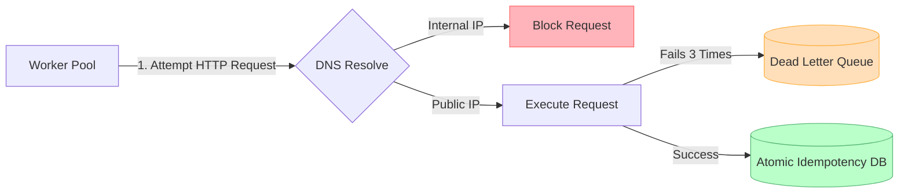

# What's New in Loom v1.0

We are thrilled to announce the completion of Loom v1.0, bringing enterprise-grade security and reliability features to our workflow automation engine!

## 🛡️ Hardened Execution Engine (SSRF Protection)
When processing user-defined HTTP requests (webhooks), you risk exposing your internal network to malicious attacks. Loom's Execution Engine now completely sandboxes these requests.

- **Private Network Blocking**: Automatically rejects attempts to contact `localhost`, `10.x.x.x`, `192.168.x.x`, and cloud metadata endpoints.
- **DNS Rebinding Defense**: We implemented a custom network transport that resolves DNS *once* and dials directly to that IP address, eliminating Time-of-Check to Time-of-Use (TOCTOU) attacks.

## ⚡ Strict Idempotency & Concurrency
In distributed systems, crashes and network blips are inevitable. We've introduced a robust layer to prevent duplicate executions (e.g., sending the same email twice).

- **Atomic Database Locks**: Using PostgreSQL `INSERT ... ON CONFLICT DO NOTHING`, workers acquire atomic locks for every side-effect they process. If two workers pick up the same job, one gets cleanly rejected.
- **Transactional Outbox**: Results are safely committed before RabbitMQ acknowledges the message, meaning zero message loss and zero duplicates.

## 🗑️ Dead Letter Queues (DLQ)
No more infinite retry loops burning through your third-party API quotas (like SendGrid).

- **Smart Retries**: Tasks that fail are automatically retried with exponential backoff.
- **DLQ Routing**: After 3 consecutive hard failures, tasks are gracefully removed from the main queue and routed to a Dead Letter Queue (`worker-dlq`) for manual inspection.

## 🩺 System Observability
- **Readiness Probes**: All three microservices (`trigger-api`, `orchestration-engine`, `node-worker-pool`) now expose native `/healthz` endpoints.
- **Deep Health Checks**: These probes don't just return a 200 OK; they actively ping the PostgreSQL databases and RabbitMQ connections to verify true operational readiness.

---

### How it all fits together

