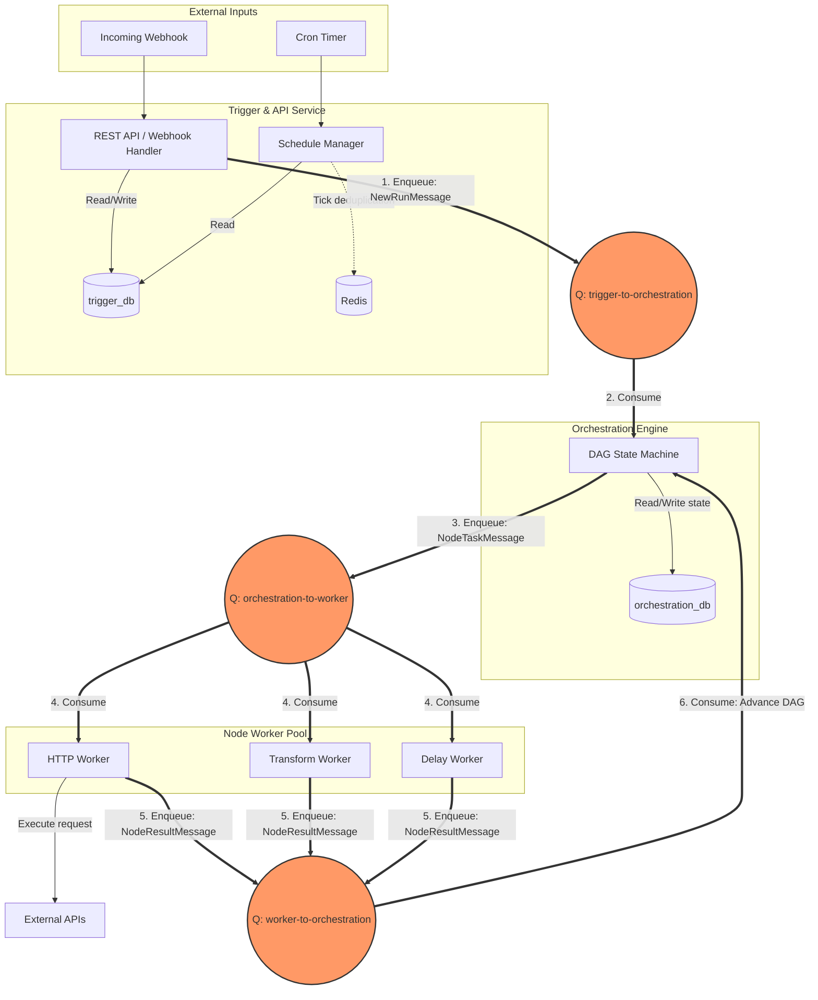
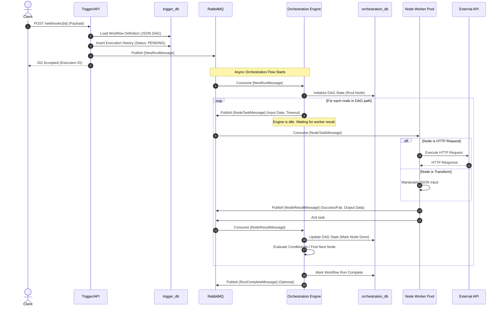

# System Architecture & Design

This document details the architectural design and data flow of Loom. It explains how the three microservices work together to achieve reliable, crash-safe execution of DAG (Directed Acyclic Graph) workflows.

## 1. High-Level Architecture Map

The system is decoupled into three independent services, communicating asynchronously via RabbitMQ. This ensures that a slow HTTP node doesn't block the Orchestration Engine, and a crash in the Worker Pool doesn't corrupt the workflow state.



---

## 2. Sequence Diagram: A Single Workflow Run

Here is the exact lifecycle of a workflow execution when a webhook is received. Notice how the Orchestration Engine acts as the "brain," delegating tasks to the Worker Pool and persisting state before every move.



---

## 3. Crash Recovery & Resilience (How it handles failures)

The hardest part of this system is ensuring a node executes exactly as intended, even if servers crash.

1. **Worker Crashes Mid-Execution:**
   - The worker pulls a task from RabbitMQ but doesn't send an ACK until it successfully publishes the result back.
   - If the worker crashes, RabbitMQ detects the TCP connection drop and **re-queues** the message. Another worker picks it up.
2. **Orchestration Engine Crashes:**
   - The Engine receives a `NodeResultMessage`. It starts updating `orchestration_db` to advance the DAG.
   - If it crashes before ACKing RabbitMQ, the message is re-delivered. The Engine checks the database, sees the node is already marked as done, and gracefully ignores the duplicate (Idempotency).
3. **External API Timeouts:**
   - The worker executes an HTTP call, but the 3rd party takes 60 seconds (worker timeout is 30s).
   - The worker aborts, publishes a `NodeResultMessage` with `Status: ERROR` and `ErrorType: TIMEOUT`.
   - The Orchestration Engine looks at the retry policy for that node. If retries > 0, the Engine schedules a delay and enqueues the task again.

---

## 4. Cross-Service Boundaries & Data Isolation

To prevent spaghetti code, the services share strictly defined boundaries.

### Shared Nothing (Database)
- The Trigger API has no access to the Orchestration state.
- The Orchestration Engine has no access to Webhook registrations or the actual UI definitions of the workflows.
- The Worker Pool has no database at all.

### The Queue Contracts (The only shared dependency)

Services only know about each other through these shared message structs (which we'll define in `shared/queue-contracts/`):

```go
// Sent by Trigger/API -> Orchestration
type NewRunMessage struct {
    ExecutionID string
    WorkflowID  string
    TriggerData map[string]interface{} // The webhook payload or cron trigger time
    WorkflowDAG DAGDefinition          // The parsed JSON of nodes/edges
}

// Sent by Orchestration -> Worker
type NodeTaskMessage struct {
    ExecutionID string
    NodeID      string
    NodeType    string                 // "HTTP", "TRANSFORM", "DELAY"
    InputData   map[string]interface{} // The resolved input for this specific node
    Config      map[string]interface{} // Node settings (URL, headers, transform rules)
}

// Sent by Worker -> Orchestration
type NodeResultMessage struct {
    ExecutionID string
    NodeID      string
    Status      string                 // "SUCCESS", "ERROR"
    OutputData  map[string]interface{} // The result of the node's work
    Error       string
}
```
